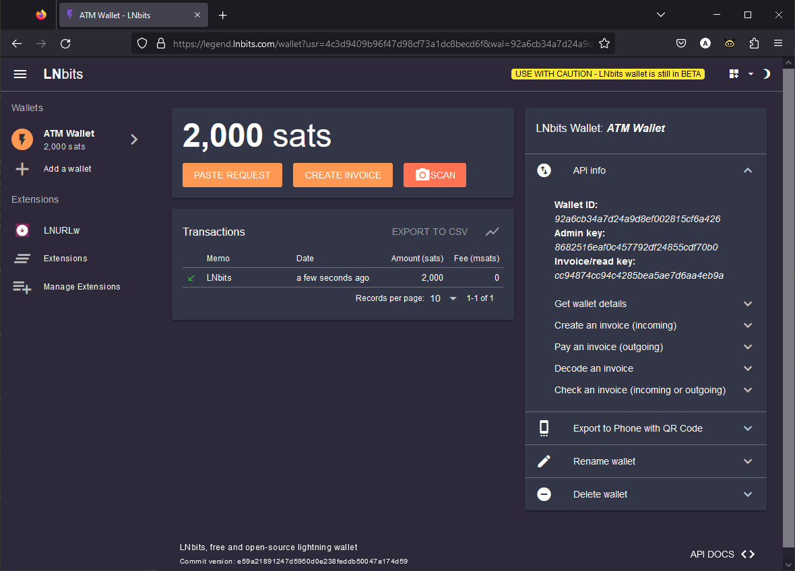
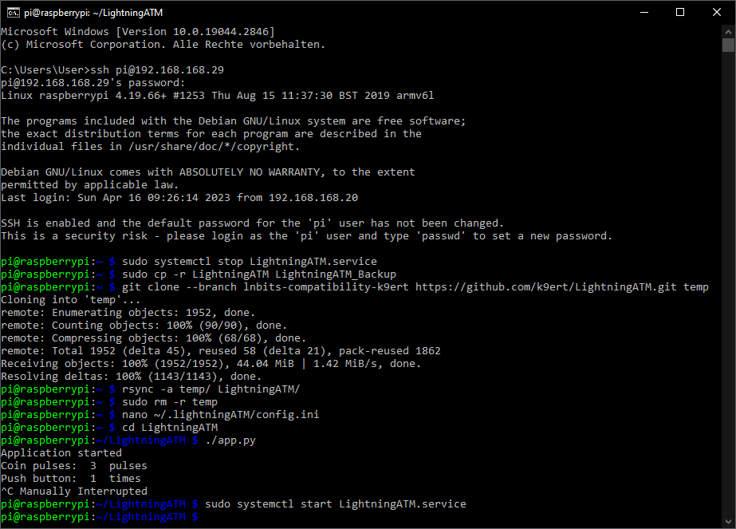
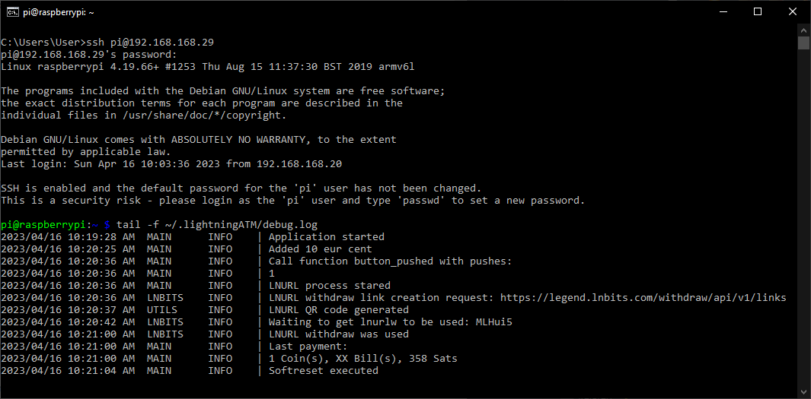

## Instruction for testing the LNbits interface 📜🧐

We have now added LNbits as a new funding source for the LightningATM. 🎉

Before we finally merge the change, we want to discuss the [pull request](https://github.com/21isenough/LightningATM/pull/78) a little bit. But you can already test the interface and for that we wrote this small guide here. It is for existing Pocket ATM's that need a new funding source. If you are setting up a new LightningATM, you just have to change under ["Perform an update, clone the ATM Github and install necessary additional options"](https://github.com/21isenough/LightningATM/blob/master/docs/guide/sdcard_and_wifi.md#perform-an-update-clone-the-atm-github-and-install-necessary-additional-options) the line `$ git clone https://github.com/21isenough/LightningATM.git` to the temporary new path `https://github.com/k9ert/LightningATM/tree/lnbits-compatibility-k9ert` with the new LNbits interface. Later we will also adjust the main documentation for this and we will test it for the ATM with camera.

### First of all, here's a quick guide on how to set up an LNbits wallet:

- Go e.g. to the [ledgend.lnbits.com](https://legend.lnbits.com/) demo server
- Assign a name and press `ADD A NEW WALLET`
- Bookmark the page and/or copy and paste the URL to a safe place. This will log you in to your wallet.
- Understand the warning! It is a demo server for testing. Keep only the necessary Satoshis in the wallet. 
- See a pop-up menu box on the right or bottom labeled `API info` and open it.
- You should see `Admin key: 7cd51a8a04...`. The number-letter combination is the `apikey` you need right now. 
- Now install an extension. Go to `Extensions`, search for `LNURLw` and activate it with `ENABLE`.
- Fund the wallet with a few thousand Satoshis.

LNbits Wallet

### 1. Update the LigthningATM 

Next we will show you how to update your LightningATM online. Connect the ATM to the power supply and log in to your LightningATM via [Wifi/SSH](https://github.com/21isenough/LightningATM/blob/master/docs/guide/sdcard_and_wifi.md#carry-out-basic-software-settings-and-updates). You may find the IP in the network of your router. Hopefully you still have the assigned password.

We will load the new repository on the ATM and activate it. You have to stop the `LightningATM.service` once, otherwise you will get a strange display and the ATM will not work properly.  

    $ sudo systemctl stop LightningATM.service
    $ sudo cp -r LightningATM LightningATM_Backup
    $ git clone --branch lnbits-compatibility-k9ert https://github.com/k9ert/LightningATM.git temp
    $ rsync -a temp/ LightningATM/
    $ sudo rm -r temp
    
Now your ATM is set to the new version. Next you have to configure it for the new wallet.
    
### 2. Edit the config.ini

    $ nano ~/.lightningATM/config.ini

#### Add the following lines at the very end

    [lnbits]
    # api credentials
    url = https://legend.lnbits.com/api/v1
    # LNbits Wallet -> API info -> Admin Key
    apikey = 
    # One of "invoice" or "lnurlw"
    method = lnurlw
    # only for lnurlw
    # millisseconds to redeem the lnurlw
    timeout = 90000

`Note:` Customize your `apikey = 7cd51a8a04...` from the LNbis wallet.

#### Change active wallet to lnbits

    activewallet = lnbits
    
Save and exit editor: `CTRL+x` -> `y` -> `Enter`
   
### 3. Start ATM for testing

    $ cd LightningATM
    $ ./app.py

- It takes a few seconds for the display to update..
- The ATM has started and you can use it normally or test the functions.
- Stop the ATM with `CTRL+C`

Update procedure

To debug: Launch a second terminal window, login with ssh and access logs with 

    $ tail -f ~/.lightningATM/debug.log`
    
Log file to debug

### 4. Final step

Restart the LightningATM service

    $ sudo systemctl start LightningATM.service

- Your ATM should now restart as usual

## Thank you for your patience! ❤
